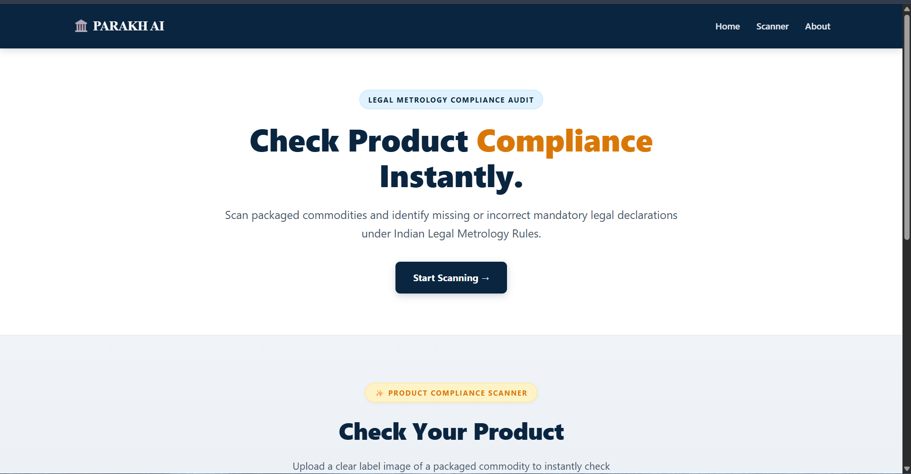
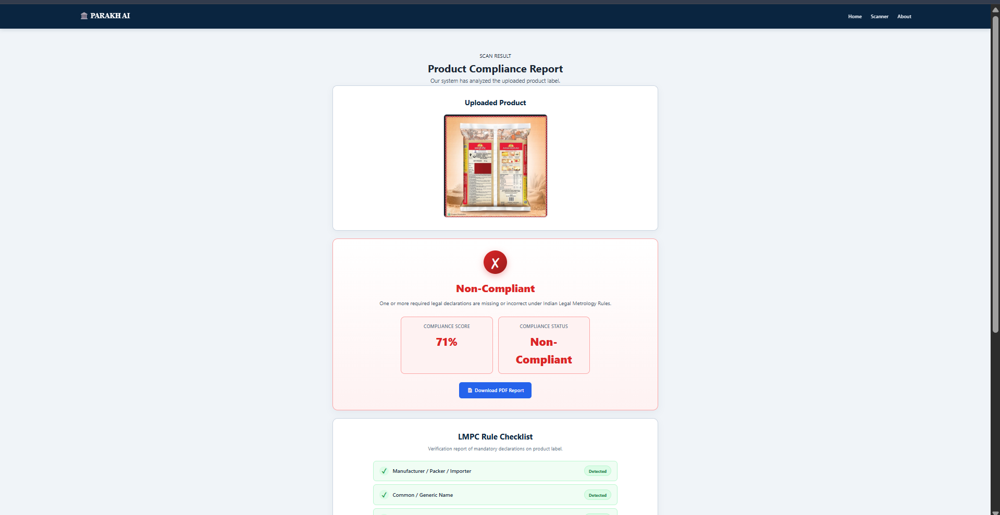
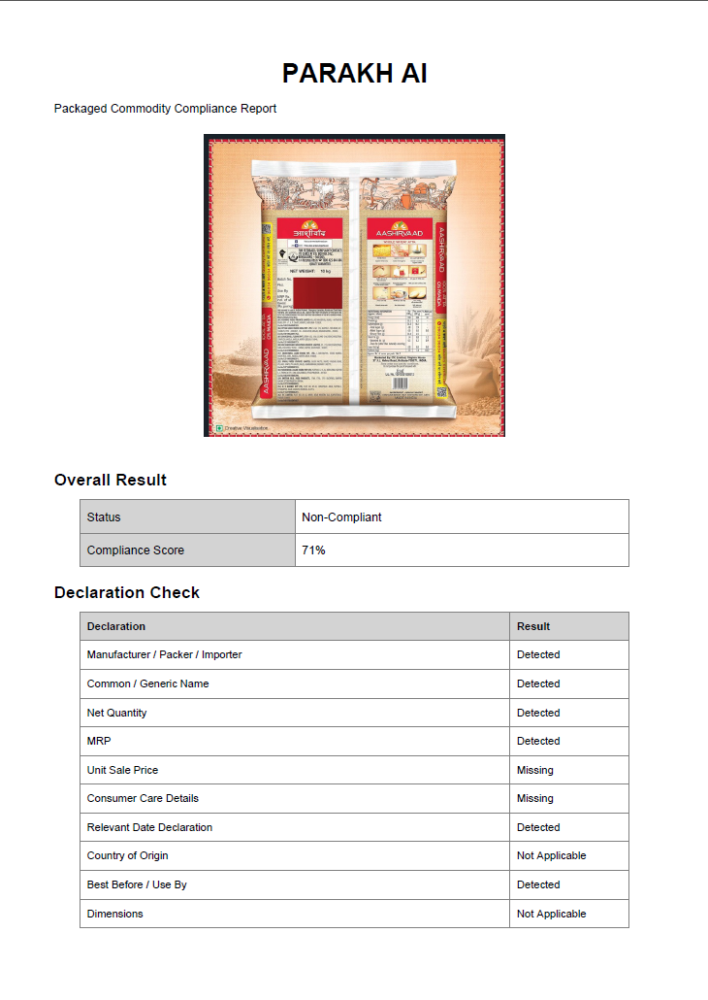
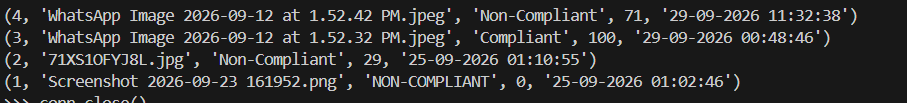

# ⚖️ PARAKH AI


**AI-powered Packaged Commodity Compliance Detection System**

PARAKH AI is a Flask-based web application that automatically checks whether packaged commodity labels comply with the **Legal Metrology (Packaged Commodities) Rules (LMPC), India**. It uses OCR to extract label text, verifies mandatory declarations, calculates a compliance score, generates PDF reports, and stores scan history in SQLite.

---

## 🌐 Live Demo

**Website:** https://parakh-ai.up.railway.app

---

## 📸 Screenshots

### Home Page



### Scan Result



### PDF Report



### SQLite Database



---

## 🚀 Features

- 📷 Upload packaged commodity images
- 🔍 OCR using Tesseract
- 🖼️ OpenCV image preprocessing
- 📦 Packaged commodity detection
- ✅ LMPC declaration verification
- 📊 Compliance score generation
- ⚠️ Compliant / Verification Required / Non-Compliant status
- 📄 Automatic PDF report generation
- 💾 SQLite database for scan history

---

## 🛠️ Tech Stack

| Technology | Purpose |
|------------|---------|
| Python | Core programming language |
| Flask | Web framework |
| OpenCV | Image preprocessing |
| Tesseract OCR | Text extraction |
| SQLite | Scan history database |
| ReportLab | PDF report generation |
| HTML/CSS | User Interface |
| Docker | Deployment container |
| Railway | Cloud hosting |

---

## 📂 Project Structure

```text
SIH-26034/
│
├── app.py
├── detector.py
├── compliance.py
├── database.py
├── report.py
├── requirements.txt
├── Dockerfile
├── render.yaml
├── Aptfile
├── parakh_ai.db
├── uploads/
├── reports/
├── screenshots/
├── templates/
├── static/
└── README.md
```

---

## ⚙️ Installation

### 1. Clone the repository

```bash
git clone https://github.com/Sourav-De67/PARAKH_AI.git
cd PARAKH_AI
```

### 2. Install dependencies

```bash
pip install -r requirements.txt
```

### 3. Install Tesseract OCR (Windows)

Download and install **Tesseract OCR**.

Default installation path:

```text
C:\Program Files\Tesseract-OCR\tesseract.exe
```

The application automatically uses the Windows path locally and the Linux path when deployed.

### 4. Run the application

```bash
python app.py
```

Open:

```text
http://127.0.0.1:5000
```

---

## 🐳 Docker Deployment

The project includes a `Dockerfile` for deployment on cloud platforms.

Build locally:

```bash
docker build -t parakh-ai .
docker run -p 5000:10000 parakh-ai
```

---

## 📋 How It Works

1. User uploads a packaged commodity image.
2. OpenCV enhances image quality.
3. Tesseract extracts text.
4. The commodity detector verifies whether it is a packaged product.
5. The LMPC compliance engine checks mandatory declarations.
6. A compliance score is calculated.
7. The result is displayed.
8. A PDF report is generated when required.
9. The scan is stored in SQLite.

---

## 📊 Compliance Categories

| Score | Result |
|-------|--------|
| 96–100% | Compliant |
| 86–95% | Verification Required |
| Below 86% | Non-Compliant |

---

## 🔍 Mandatory Declarations Checked

- Manufacturer / Packer / Importer
- Common / Generic Name
- Net Quantity
- MRP
- Unit Sale Price
- Consumer Care Details
- Relevant Date Declaration

### Conditional Declarations

- Country of Origin
- Best Before / Use By
- Dimensions

---

## 📄 PDF Report

The generated report includes:

- Uploaded product image
- Compliance score
- Compliance status
- LMPC declaration checklist
- Inspection disclaimer

---

## 💾 Database

SQLite automatically stores every scan.

Stored information includes:

- Image name
- Compliance status
- Compliance score
- Declaration detection results
- Scan timestamp

---

## 🎯 Future Scope

- Multi-language OCR
- Barcode/QR verification
- Inspector dashboard
- Cloud database support
- Mobile application

---

## 👨‍💻 Developed By

**PARAKH AI Team**

Built as a **Smart India Hackathon (SIH)** prototype for automated packaged commodity compliance verification.